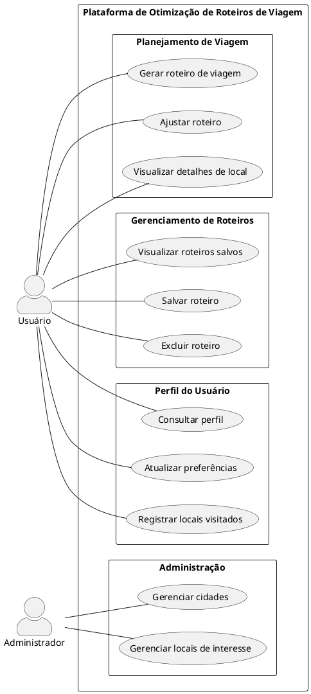

# Casos de Uso
---

---

```plantuml
@startuml
left to right direction
skinparam packageStyle rectangle
skinparam shadowing false
skinparam actorStyle awesome

actor "Usuário" as Usuario
actor "Administrador" as Admin

rectangle "Plataforma de Otimização de Roteiros de Viagem" {

  package "Planejamento de Viagem" {
    usecase "Gerar roteiro de viagem" as UC1
    usecase "Ajustar roteiro" as UC2
    usecase "Visualizar detalhes de local" as UC3
  }

  package "Gerenciamento de Roteiros" {
    usecase "Visualizar roteiros salvos" as UC4
    usecase "Salvar roteiro" as UC5
    usecase "Excluir roteiro" as UC6
  }

  package "Perfil do Usuário" {
    usecase "Consultar perfil" as UC7
    usecase "Atualizar preferências" as UC8
    usecase "Registrar locais visitados" as UC9
  }

  package "Administração" {
    usecase "Gerenciar cidades" as UC10
    usecase "Gerenciar locais de interesse" as UC11
  }
}

' --- Associações Usuário ---
Usuario -- UC1
Usuario -- UC2
Usuario -- UC3
Usuario -- UC4
Usuario -- UC5
Usuario -- UC6
Usuario -- UC7
Usuario -- UC8
Usuario -- UC9

' --- Associações Admin ---
Admin -- UC10
Admin -- UC11


@enduml
```
