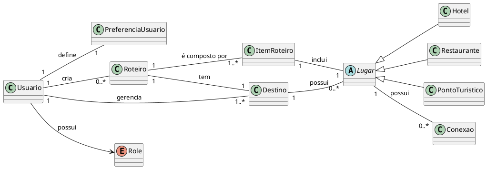

# Diagrama Classes de Domínio
---

---

```plantuml
@startuml
left to right direction
skinparam classAttributeIconSize 0

class Usuario
class PreferenciaUsuario
class Roteiro
class Destino
abstract class Lugar
class Hotel
class Restaurante
class PontoTuristico
class ItemRoteiro
class Conexao

enum Role

Usuario "1" -- "1" PreferenciaUsuario : define
Usuario "1" -- "0..*" Roteiro : cria
Usuario --> Role : possui

Roteiro "1" -- "1" Destino : tem
Roteiro "1" -- "1..*" ItemRoteiro : é composto por
Usuario "1" -- "1..*" Destino: gerencia

Destino "1" -- "0..*" Lugar : possui
Lugar "1" -- "0..*" Conexao: possui

ItemRoteiro "1" -- "1" Lugar : inclui

Lugar <|-- Hotel
Lugar <|-- Restaurante
Lugar <|-- PontoTuristico

@enduml
```
