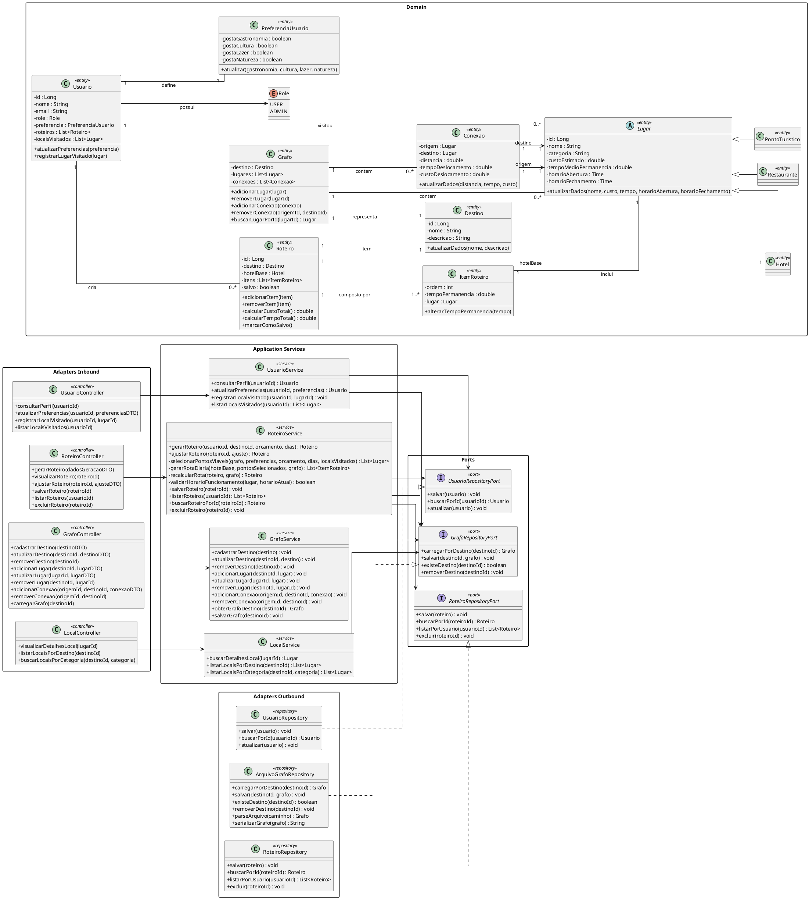

```plantuml
@startuml
left to right direction
skinparam classAttributeIconSize 0
skinparam packageStyle rectangle
skinparam linetype ortho

package "Adapters Inbound" {

  class UsuarioController <<controller>> {
    +consultarPerfil(usuarioId)
    +atualizarPreferencias(usuarioId, preferenciasDTO)
    +registrarLocalVisitado(usuarioId, lugarId)
    +listarLocaisVisitados(usuarioId)
  }

  class RoteiroController <<controller>> {
    +gerarRoteiro(dadosGeracaoDTO)
    +visualizarRoteiro(roteiroId)
    +ajustarRoteiro(roteiroId, ajusteDTO)
    +salvarRoteiro(roteiroId)
    +listarRoteiros(usuarioId)
    +excluirRoteiro(roteiroId)
  }

  class GrafoController <<controller>> {
    +cadastrarDestino(destinoDTO)
    +atualizarDestino(destinoId, destinoDTO)
    +removerDestino(destinoId)
    +adicionarLugar(destinoId, lugarDTO)
    +atualizarLugar(lugarId, lugarDTO)
    +removerLugar(destinoId, lugarId)
    +adicionarConexao(origemId, destinoId, conexaoDTO)
    +removerConexao(origemId, destinoId)
    +carregarGrafo(destinoId)
  }

  class LocalController <<controller>> {
    +visualizarDetalhesLocal(lugarId)
    +listarLocaisPorDestino(destinoId)
    +buscarLocaisPorCategoria(destinoId, categoria)
  }
}

package "Application Services" {

  class UsuarioService <<service>> {
    +consultarPerfil(usuarioId) : Usuario
    +atualizarPreferencias(usuarioId, preferencias) : Usuario
    +registrarLocalVisitado(usuarioId, lugarId) : void
    +listarLocaisVisitados(usuarioId) : List<Lugar>
  }

  class RoteiroService <<service>> {
    +gerarRoteiro(usuarioId, destinoId, orcamento, dias) : Roteiro
    +ajustarRoteiro(roteiroId, ajuste) : Roteiro
    -selecionarPontosViaveis(grafo, preferencias, orcamento, dias, locaisVisitados) : List<Lugar>
    -gerarRotaDiaria(hotelBase, pontosSelecionados, grafo) : List<ItemRoteiro>
    -recalcularRota(roteiro, grafo) : Roteiro
    -validarHorarioFuncionamento(lugar, horarioAtual) : boolean
    +salvarRoteiro(roteiroId) : void
    +listarRoteiros(usuarioId) : List<Roteiro>
    +buscarRoteiroPorId(roteiroId) : Roteiro
    +excluirRoteiro(roteiroId) : void
  }

  class GrafoService <<service>> {
    +cadastrarDestino(destino) : void
    +atualizarDestino(destinoId, destino) : void
    +removerDestino(destinoId) : void
    +adicionarLugar(destinoId, lugar) : void
    +atualizarLugar(lugarId, lugar) : void
    +removerLugar(destinoId, lugarId) : void
    +adicionarConexao(origemId, destinoId, conexao) : void
    +removerConexao(origemId, destinoId) : void
    +obterGrafoDestino(destinoId) : Grafo
    +salvarGrafo(destinoId) : void
  }

  class LocalService <<service>> {
    +buscarDetalhesLocal(lugarId) : Lugar
    +listarLocaisPorDestino(destinoId) : List<Lugar>
    +listarLocaisPorCategoria(destinoId, categoria) : List<Lugar>
  }
}

package "Domain" {

  class Usuario <<entity>> {
    -id : Long
    -nome : String
    -email : String
    -role : Role
    -preferencia : PreferenciaUsuario
    -roteiros : List<Roteiro>
    -locaisVisitados : List<Lugar>
    +atualizarPreferencias(preferencia)
    +registrarLugarVisitado(lugar)
  }

  class PreferenciaUsuario <<entity>> {
    -gostaGastronomia : boolean
    -gostaCultura : boolean
    -gostaLazer : boolean
    -gostaNatureza : boolean
    +atualizar(gastronomia, cultura, lazer, natureza)
  }

  class Roteiro <<entity>> {
    -id : Long
    -destino : Destino
    -hotelBase : Hotel
    -itens : List<ItemRoteiro>
    -salvo : boolean
    +adicionarItem(item)
    +removerItem(item)
    +calcularCustoTotal() : double
    +calcularTempoTotal() : double
    +marcarComoSalvo()
  }

  class ItemRoteiro <<entity>> {
    -ordem : int
    -tempoPermanencia : double
    -lugar : Lugar
    +alterarTempoPermanencia(tempo)
  }

  class Destino <<entity>> {
    -id : Long
    -nome : String
    -descricao : String
    +atualizarDados(nome, descricao)
  }

  class Grafo <<entity>> {
    -destino : Destino
    -lugares : List<Lugar>
    -conexoes : List<Conexao>
    +adicionarLugar(lugar)
    +removerLugar(lugarId)
    +adicionarConexao(conexao)
    +removerConexao(origemId, destinoId)
    +buscarLugarPorId(lugarId) : Lugar
  }

  abstract class Lugar <<entity>> {
    -id : Long
    -nome : String
    -categoria : String
    -custoEstimado : double
    -tempoMedioPermanencia : double
    -horarioAbertura : Time
    -horarioFechamento : Time
    +atualizarDados(nome, custo, tempo, horarioAbertura, horarioFechamento)
  }

  class Hotel <<entity>>
  class Restaurante <<entity>>
  class PontoTuristico <<entity>>

  class Conexao <<entity>> {
    -origem : Lugar
    -destino : Lugar
    -distancia : double
    -tempoDeslocamento : double
    -custoDeslocamento : double
    +atualizarDados(distancia, tempo, custo)
  }

  enum Role {
    USER
    ADMIN
  }
}

package "Ports" {

  interface UsuarioRepositoryPort <<port>> {
    +salvar(usuario) : void
    +buscarPorId(usuarioId) : Usuario
    +atualizar(usuario) : void
  }

  interface RoteiroRepositoryPort <<port>> {
    +salvar(roteiro) : void
    +buscarPorId(roteiroId) : Roteiro
    +listarPorUsuario(usuarioId) : List<Roteiro>
    +excluir(roteiroId) : void
  }

  interface GrafoRepositoryPort <<port>> {
    +carregarPorDestino(destinoId) : Grafo
    +salvar(destinoId, grafo) : void
    +existeDestino(destinoId) : boolean
    +removerDestino(destinoId) : void
  }
}

package "Adapters Outbound" {

  class UsuarioRepository <<repository>> {
    +salvar(usuario) : void
    +buscarPorId(usuarioId) : Usuario
    +atualizar(usuario) : void
  }

  class RoteiroRepository <<repository>> {
    +salvar(roteiro) : void
    +buscarPorId(roteiroId) : Roteiro
    +listarPorUsuario(usuarioId) : List<Roteiro>
    +excluir(roteiroId) : void
  }

  class ArquivoGrafoRepository <<repository>> {
    +carregarPorDestino(destinoId) : Grafo
    +salvar(destinoId, grafo) : void
    +existeDestino(destinoId) : boolean
    +removerDestino(destinoId) : void
    +parseArquivo(caminho) : Grafo
    +serializarGrafo(grafo) : String
  }
}

' Controllers -> Services
UsuarioController --> UsuarioService
RoteiroController --> RoteiroService
GrafoController --> GrafoService
LocalController --> LocalService

' Services -> Ports
UsuarioService --> UsuarioRepositoryPort
UsuarioService --> GrafoRepositoryPort

RoteiroService --> UsuarioRepositoryPort
RoteiroService --> RoteiroRepositoryPort
RoteiroService --> GrafoRepositoryPort

GrafoService --> GrafoRepositoryPort
LocalService --> GrafoRepositoryPort

' Adapters -> Ports
UsuarioRepository ..|> UsuarioRepositoryPort
RoteiroRepository ..|> RoteiroRepositoryPort
ArquivoGrafoRepository ..|> GrafoRepositoryPort

' Domain relations
Usuario "1" -- "1" PreferenciaUsuario : define
Usuario "1" -- "0..*" Roteiro : cria
Usuario "1" -- "0..*" Lugar : visitou
Usuario --> Role : possui

Roteiro "1" -- "1" Destino : tem
Roteiro "1" -- "1" Hotel : hotelBase
Roteiro "1" -- "1..*" ItemRoteiro : composto por
ItemRoteiro "1" -- "1" Lugar : inclui

Grafo "1" -- "1" Destino : representa
Grafo "1" -- "0..*" Lugar : contem
Grafo "1" -- "0..*" Conexao : contem

Conexao "1" --> "1" Lugar : origem
Conexao "1" --> "1" Lugar : destino

Lugar <|-- Hotel
Lugar <|-- Restaurante
Lugar <|-- PontoTuristico

@enduml
```
