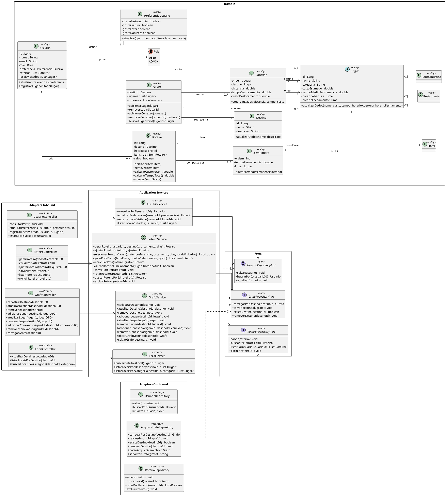

# Diagrma CLasses de Implementação
---
![](https://www.plantuml.com/plantuml/png/pLXBKnov3x_Ff-ZYyf__Bb3PwrQA2WjvK9K75SZUDTrYyCPjpzhkgS0cttrbjyRZCOAUuh0L3dIFzDD3iYpB_Se7S67ezKpZJMY2RPnQteQcKmxReAoP-Q_AhC11txGQl3yDmQd54F2YjUPAtMFpee2ieFqAIxmATngRg07CKcC1qCfWk5jXOrsujRCP2pG7fnsi0ZhVN9Y57KntqFmpcpMZpUQB7y0fUsPDS5PhTCtBbst-SN92s8R-VYMQ7tG0TudkHkdvCCfTTFyV-H06qEgU-0vlqA5f5VWjwh1P5VJpwqyivd2fV73WtjiMz9_Agm2TBUNqi0INpMX2Zs3bDsY_wyoFRN2VRK3bfeDReWF7u7aNLRubIWjsw-XQ-J70Z7FfMMJWhy47WNtO90vkTNdGQm5OX9Yv_a6YyLkh1oLAbw6_TN2pnwf21odzv-Y3CXHyUkQuyxhMY1JN0x33tgwnWXOPwbIhhA7rYslAxEqY2qP7OE8AC3OdQtjebRA1ty3EhLDBx2Ema6b7PgtyAI46jk0Sai6KyUn6lHwflYVMewooSmoWRz4dkVdZc-3IFfhknU3R0dO60PVMAPYNOM-8exi_ohQnMcb5V6LDSuLkhLhqKkjW7aNanxTzcaRp-qRy6UsZbjw_YqJ9jLNTVis4mEy9yZ8Ls8dOMiJWXQR2IgkYiww57asmHEMuM62_bb8B77dKE1RxfIMr51MiKVdvCjRcRX9hwqJGkvceuqyMDb71kO9OIxSseFu3F9BsPFAANI0Df38Ppeek0lRiBwjps89k1ptgt4IOvQhmrg1L1-wTTJ6PRmQJ3AKOnYrosDoElDDOJr5-OQr6C4ytNg4g62ILGuuWxx8ClxHKPBkAcICqRz63keSB5JRPlREsoGvU2KnqSKRjrSmhiDZG1UXqKsVmCtgxQ4SM5EArYu1ZZnSJapX5bIMedBpwL91NE1UNV1OaXIb9Uvq9TJCJXAPEY5f3VLwSsnwKaKu8YWnDKE4k1tQakgZDckNuqzWUYN0LdDgGaBJfYkQinhIbD8w4eg4HlJWxs3AByLuMD_1HrVMaFCcdKs6ydcQJCAlarbJD0vMlSfQMrWTu2wJIKeOKbFqiyyy67GOdyzx3FJgHyn582EyBiIhK-N9hbweW6Q4N7JKUDeR5vO5xUi6vm8Z6bJgIysb2Z7VndOK36l_u8H8tdAq3oQqXukUA_kqETZLvSmwT3JxOQnj0psF5TtPOQDo5N6E_UWJIWsj9X-tjLNHgNkKd-oxcoBeEUrAeJ1W98HgwHDU3uHelZHsbkjfj0w03ElAm4fmdJPKpdFbdxSuEVUjK2pRJwyCcpL9Hyh39OE6E8faNYuF3HIzD9Qd3sosFk_g9U5GbFT8LOkBUmCV8rFr06iFPT1eFf0QUaWABs3lQmDb9l6SjJcxPDJsMzcloheVELhMK2kG3Tkg9UjlCLWjqt76kLR_BUuFjxJYGbLovB98xXqsqJ8zAUIPaZNNrfFvGv6VRXD0781KceCHEa_7ru9GFghKb8aDuKONaZykSLwuiruf8wa78OOgMobfR7huhVagAp9SocStaF2O5ELLeXZwTbnp0bwlNdzFBwVc7YuyFpd0gqB2vv2aJqDr0YvjZ_3Ekh5V1khi8e-IiwC6foMCFpylLi9Ns09V_z2LGKl9ZroLkelkvv19OT6bYOES9YL3iwEHrW2Vy7PLo3AdzJKIGFouGSx-nSylEboYsp-wHooYgujDpxpi0LqxzaV7J4AIlZ5K5KQ0k__ZlQgWQL2OS-ZahY2CuTNyFQcsvYEGmVluoIgWLE8ySpxo5NfbRMtk5JgLrvNjLzedFDox7_pNRJso-EJh97wvc3xzp7n6RgOoQyK9Ke96QGSc12X9f6P2kQHMWlEX5D_ar-PYQxcpNbIGazbq1A7MI6GSphL02Caa4JbjEn2bKoiWKY3AL6qkTgQBeZu-_JmHNW-K0XJt54e-wDzvw6uSwVIdDtZK7lnrGMEaXtFNeKCSRPV01_CNnyIy7x5w4jKw13E81aJQIYYuD6JKkOBefaxT-KBaMIgVEyzGIi9S0QRuYThwJFGH5D_ATXlsrFHaDbaox6RCgpTbnPMAdutgHVNEuSkZH162Kd8BM6Z8bGV8ibq4pfZ3kPCUbSRvx4i9DR3RZ0VqxsKgvAWZb35gGgzbpzWfDD_JwNm00)
---

