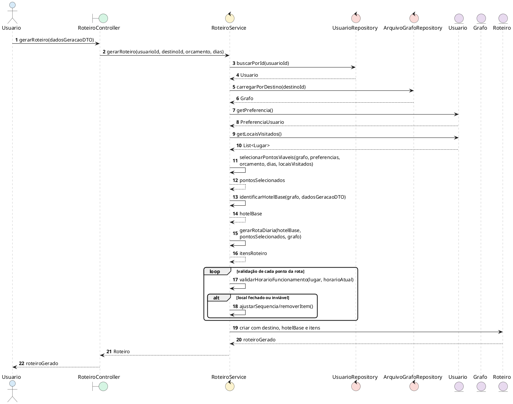

# UC01 - Gerar Roteiro
---

---

```plantuml
@startuml
autonumber

skinparam shadowing false
skinparam roundcorner 12
skinparam sequence {
  ArrowThickness 1
  LifeLineBorderColor #999999
  LifeLineBackgroundColor #F9F9F9
  ParticipantBorderColor #666666
  ParticipantFontStyle bold
  ParticipantBackgroundColor white
}
skinparam linetype ortho

actor Usuario #D6EAF8
boundary RoteiroController #D5F5E3
control RoteiroService #FCF3CF
control UsuarioRepository #FADBD8
control ArquivoGrafoRepository #FADBD8
entity "Usuario" as UsuarioDomain #E8DAEF
entity Grafo #E8DAEF
entity Roteiro #E8DAEF

Usuario -> RoteiroController : gerarRoteiro(dadosGeracaoDTO)
RoteiroController -> RoteiroService : gerarRoteiro(usuarioId, destinoId, orcamento, dias)

RoteiroService -> UsuarioRepository : buscarPorId(usuarioId)
UsuarioRepository --> RoteiroService : Usuario

RoteiroService -> ArquivoGrafoRepository : carregarPorDestino(destinoId)
ArquivoGrafoRepository --> RoteiroService : Grafo

RoteiroService -> UsuarioDomain : getPreferencia()
UsuarioDomain --> RoteiroService : PreferenciaUsuario

RoteiroService -> UsuarioDomain : getLocaisVisitados()
UsuarioDomain --> RoteiroService : List<Lugar>

RoteiroService -> RoteiroService : selecionarPontosViaveis(grafo, preferencias,\norcamento, dias, locaisVisitados)
RoteiroService --> RoteiroService : pontosSelecionados

RoteiroService -> RoteiroService : identificarHotelBase(grafo, dadosGeracaoDTO)
RoteiroService --> RoteiroService : hotelBase

RoteiroService -> RoteiroService : gerarRotaDiaria(hotelBase,\npontosSelecionados, grafo)
RoteiroService --> RoteiroService : itensRoteiro

loop validação de cada ponto da rota
  RoteiroService -> RoteiroService : validarHorarioFuncionamento(lugar, horarioAtual)
  alt local fechado ou inviável
    RoteiroService -> RoteiroService : ajustarSequencia/removerItem()
  end
end

RoteiroService -> Roteiro : criar com destino, hotelBase e itens
Roteiro --> RoteiroService : roteiroGerado

RoteiroService --> RoteiroController : Roteiro
RoteiroController --> Usuario : roteiroGerado
@enduml
```
