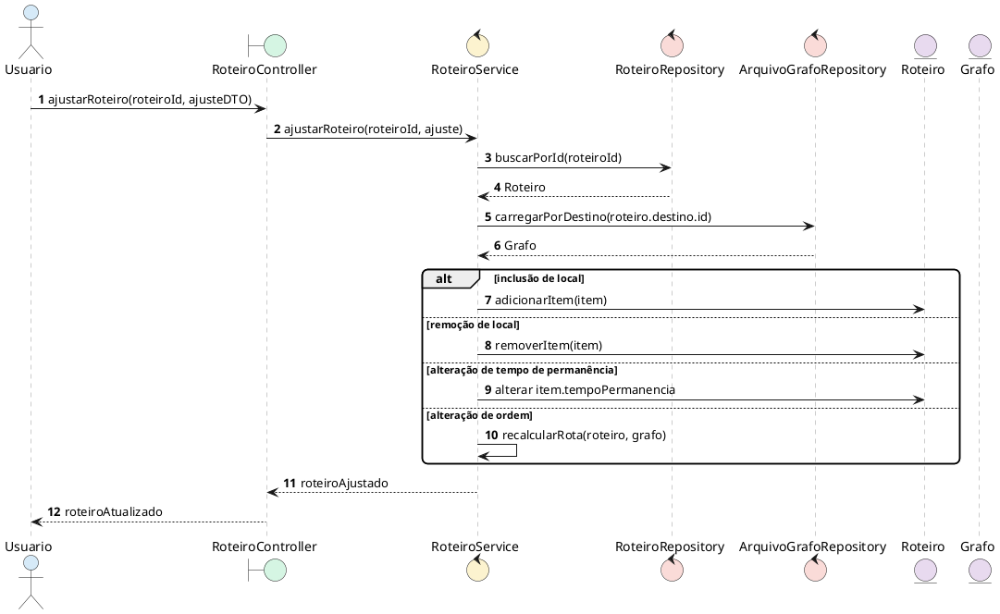

# UC02 - Ajustar Roteiro
---

---

```plantuml
@startuml
autonumber

skinparam shadowing false
skinparam roundcorner 12
skinparam sequence {
  ArrowThickness 1
  LifeLineBorderColor #999999
  LifeLineBackgroundColor #F9F9F9
  ParticipantBorderColor #666666
  ParticipantFontStyle bold
  ParticipantBackgroundColor white
}
skinparam linetype ortho

actor Usuario #D6EAF8
boundary RoteiroController #D5F5E3
control RoteiroService #FCF3CF
control RoteiroRepository #FADBD8
control ArquivoGrafoRepository #FADBD8
entity Roteiro #E8DAEF
entity Grafo #E8DAEF

Usuario -> RoteiroController : ajustarRoteiro(roteiroId, ajusteDTO)
RoteiroController -> RoteiroService : ajustarRoteiro(roteiroId, ajuste)

RoteiroService -> RoteiroRepository : buscarPorId(roteiroId)
RoteiroRepository --> RoteiroService : Roteiro

RoteiroService -> ArquivoGrafoRepository : carregarPorDestino(roteiro.destino.id)
ArquivoGrafoRepository --> RoteiroService : Grafo

alt inclusão de local
  RoteiroService -> Roteiro : adicionarItem(item)
else remoção de local
  RoteiroService -> Roteiro : removerItem(item)
else alteração de tempo de permanência
  RoteiroService -> Roteiro : alterar item.tempoPermanencia
else alteração de ordem
  RoteiroService -> RoteiroService : recalcularRota(roteiro, grafo)
end

RoteiroService --> RoteiroController : roteiroAjustado
RoteiroController --> Usuario : roteiroAtualizado
@enduml
```
