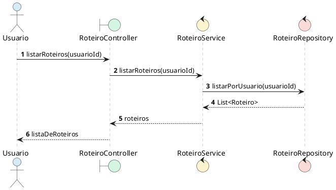

# UC04 - Vizualizar Roteiros Salvos
---

---

```plantuml
@startuml

autonumber

skinparam shadowing false
skinparam roundcorner 12
skinparam sequence {
  ArrowThickness 1
  LifeLineBorderColor #999999
  LifeLineBackgroundColor #F9F9F9
  ParticipantBorderColor #666666
  ParticipantFontStyle bold
  ParticipantBackgroundColor white
}
skinparam linetype ortho

actor Usuario #D6EAF8
boundary RoteiroController #D5F5E3
control RoteiroService #FCF3CF
control RoteiroRepository #FADBD8

Usuario -> RoteiroController : listarRoteiros(usuarioId)
RoteiroController -> RoteiroService : listarRoteiros(usuarioId)

RoteiroService -> RoteiroRepository : listarPorUsuario(usuarioId)
RoteiroRepository --> RoteiroService : List<Roteiro>

RoteiroService --> RoteiroController : roteiros
RoteiroController --> Usuario : listaDeRoteiros
@enduml
```
