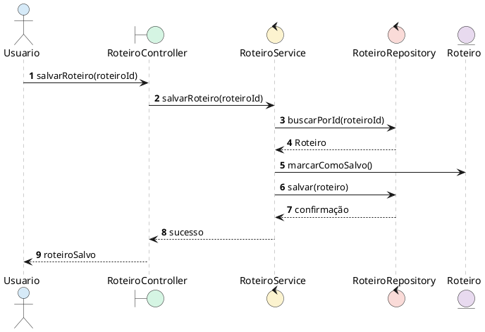

# UC05 - Salvar Roteiro
---

---

```plantuml
@startuml
autonumber

skinparam shadowing false
skinparam roundcorner 12
skinparam sequence {
  ArrowThickness 1
  LifeLineBorderColor #999999
  LifeLineBackgroundColor #F9F9F9
  ParticipantBorderColor #666666
  ParticipantFontStyle bold
  ParticipantBackgroundColor white
}
skinparam linetype ortho

actor Usuario #D6EAF8
boundary RoteiroController #D5F5E3
control RoteiroService #FCF3CF
control RoteiroRepository #FADBD8
entity Roteiro #E8DAEF

Usuario -> RoteiroController : salvarRoteiro(roteiroId)
RoteiroController -> RoteiroService : salvarRoteiro(roteiroId)

RoteiroService -> RoteiroRepository : buscarPorId(roteiroId)
RoteiroRepository --> RoteiroService : Roteiro

RoteiroService -> Roteiro : marcarComoSalvo()

RoteiroService -> RoteiroRepository : salvar(roteiro)
RoteiroRepository --> RoteiroService : confirmação

RoteiroService --> RoteiroController : sucesso
RoteiroController --> Usuario : roteiroSalvo
@enduml
```
