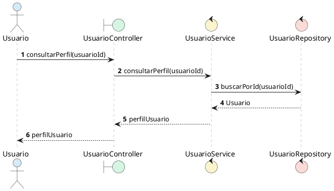

# UC07 - Consultar Perfil
---

---

```plantuml
@startuml
autonumber

skinparam shadowing false
skinparam roundcorner 12
skinparam sequence {
  ArrowThickness 1
  LifeLineBorderColor #999999
  LifeLineBackgroundColor #F9F9F9
  ParticipantBorderColor #666666
  ParticipantFontStyle bold
  ParticipantBackgroundColor white
}
skinparam linetype ortho

actor Usuario #D6EAF8
boundary UsuarioController #D5F5E3
control UsuarioService #FCF3CF
control UsuarioRepository #FADBD8

Usuario -> UsuarioController : consultarPerfil(usuarioId)
UsuarioController -> UsuarioService : consultarPerfil(usuarioId)

UsuarioService -> UsuarioRepository : buscarPorId(usuarioId)
UsuarioRepository --> UsuarioService : Usuario

UsuarioService --> UsuarioController : perfilUsuario
UsuarioController --> Usuario : perfilUsuario
@enduml
```
