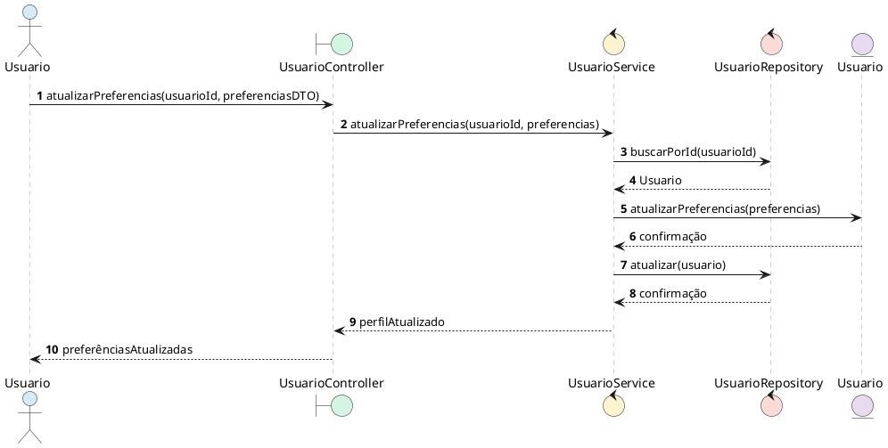

# UC08 - Atualizar Prefêrencias
---

---

```plantuml
@startuml
autonumber

skinparam shadowing false
skinparam roundcorner 12
skinparam sequence {
  ArrowThickness 1
  LifeLineBorderColor #999999
  LifeLineBackgroundColor #F9F9F9
  ParticipantBorderColor #666666
  ParticipantFontStyle bold
  ParticipantBackgroundColor white
}
skinparam linetype ortho

actor Usuario #D6EAF8
boundary UsuarioController #D5F5E3
control UsuarioService #FCF3CF
control UsuarioRepository #FADBD8
entity "Usuario" as UsuarioDomain #E8DAEF

Usuario -> UsuarioController : atualizarPreferencias(usuarioId, preferenciasDTO)
UsuarioController -> UsuarioService : atualizarPreferencias(usuarioId, preferencias)

UsuarioService -> UsuarioRepository : buscarPorId(usuarioId)
UsuarioRepository --> UsuarioService : Usuario

UsuarioService -> UsuarioDomain : atualizarPreferencias(preferencias)
UsuarioDomain --> UsuarioService : confirmação

UsuarioService -> UsuarioRepository : atualizar(usuario)
UsuarioRepository --> UsuarioService : confirmação

UsuarioService --> UsuarioController : perfilAtualizado
UsuarioController --> Usuario : preferênciasAtualizadas
@enduml
```
