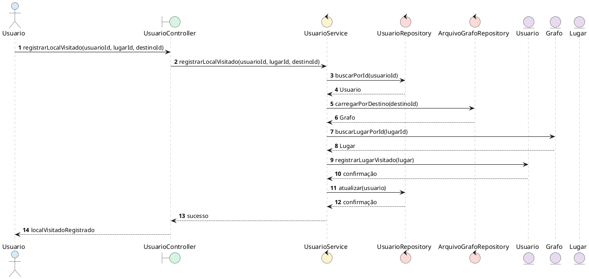

# UC09 -  Registrar Lugar Visitado
---

---

```plantuml
@startuml
autonumber

skinparam shadowing false
skinparam roundcorner 12
skinparam sequence {
  ArrowThickness 1
  LifeLineBorderColor #999999
  LifeLineBackgroundColor #F9F9F9
  ParticipantBorderColor #666666
  ParticipantFontStyle bold
  ParticipantBackgroundColor white
}
skinparam linetype ortho

actor Usuario #D6EAF8
boundary UsuarioController #D5F5E3
control UsuarioService #FCF3CF
control UsuarioRepository #FADBD8
control ArquivoGrafoRepository #FADBD8
entity "Usuario" as UsuarioDomain #E8DAEF
entity Grafo #E8DAEF
entity Lugar #E8DAEF

Usuario -> UsuarioController : registrarLocalVisitado(usuarioId, lugarId, destinoId)
UsuarioController -> UsuarioService : registrarLocalVisitado(usuarioId, lugarId, destinoId)

UsuarioService -> UsuarioRepository : buscarPorId(usuarioId)
UsuarioRepository --> UsuarioService : Usuario

UsuarioService -> ArquivoGrafoRepository : carregarPorDestino(destinoId)
ArquivoGrafoRepository --> UsuarioService : Grafo

UsuarioService -> Grafo : buscarLugarPorId(lugarId)
Grafo --> UsuarioService : Lugar

UsuarioService -> UsuarioDomain : registrarLugarVisitado(lugar)
UsuarioDomain --> UsuarioService : confirmação

UsuarioService -> UsuarioRepository : atualizar(usuario)
UsuarioRepository --> UsuarioService : confirmação

UsuarioService --> UsuarioController : sucesso
UsuarioController --> Usuario : localVisitadoRegistrado
@enduml
```
