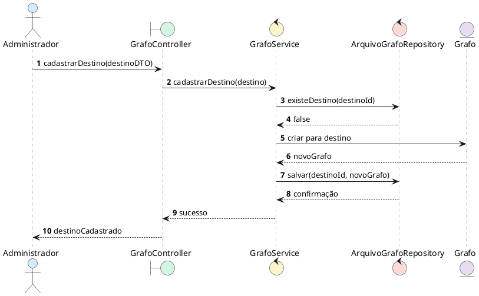

# UC10 - Gerenciar Destinos
---

---

```plantuml
@startuml

autonumber

skinparam shadowing false
skinparam roundcorner 12
skinparam sequence {
  ArrowThickness 1
  LifeLineBorderColor #999999
  LifeLineBackgroundColor #F9F9F9
  ParticipantBorderColor #666666
  ParticipantFontStyle bold
  ParticipantBackgroundColor white
}
skinparam linetype ortho

actor Administrador #D6EAF8
boundary GrafoController #D5F5E3
control GrafoService #FCF3CF
control ArquivoGrafoRepository #FADBD8
entity Grafo #E8DAEF

Administrador -> GrafoController : cadastrarDestino(destinoDTO)
GrafoController -> GrafoService : cadastrarDestino(destino)

GrafoService -> ArquivoGrafoRepository : existeDestino(destinoId)
ArquivoGrafoRepository --> GrafoService : false

GrafoService -> Grafo : criar para destino
Grafo --> GrafoService : novoGrafo

GrafoService -> ArquivoGrafoRepository : salvar(destinoId, novoGrafo)
ArquivoGrafoRepository --> GrafoService : confirmação

GrafoService --> GrafoController : sucesso
GrafoController --> Administrador : destinoCadastrado
@enduml
```
