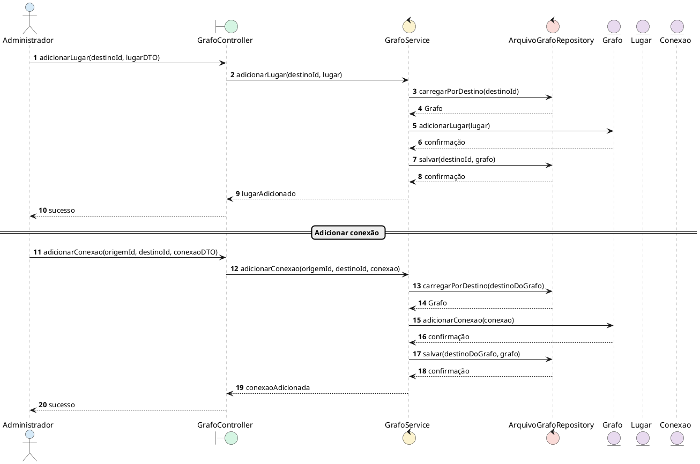

# UC11 - Gerenciar Locais e Conexões
---

---

```plantuml
@startuml
autonumber

skinparam shadowing false
skinparam roundcorner 12
skinparam sequence {
  ArrowThickness 1
  LifeLineBorderColor #999999
  LifeLineBackgroundColor #F9F9F9
  ParticipantBorderColor #666666
  ParticipantFontStyle bold
  ParticipantBackgroundColor white
}
skinparam linetype ortho

actor Administrador #D6EAF8
boundary GrafoController #D5F5E3
control GrafoService #FCF3CF
control ArquivoGrafoRepository #FADBD8
entity Grafo #E8DAEF
entity Lugar #E8DAEF
entity Conexao #E8DAEF

Administrador -> GrafoController : adicionarLugar(destinoId, lugarDTO)
GrafoController -> GrafoService : adicionarLugar(destinoId, lugar)

GrafoService -> ArquivoGrafoRepository : carregarPorDestino(destinoId)
ArquivoGrafoRepository --> GrafoService : Grafo

GrafoService -> Grafo : adicionarLugar(lugar)
Grafo --> GrafoService : confirmação

GrafoService -> ArquivoGrafoRepository : salvar(destinoId, grafo)
ArquivoGrafoRepository --> GrafoService : confirmação

GrafoService --> GrafoController : lugarAdicionado
GrafoController --> Administrador : sucesso

== Adicionar conexão ==

Administrador -> GrafoController : adicionarConexao(origemId, destinoId, conexaoDTO)
GrafoController -> GrafoService : adicionarConexao(origemId, destinoId, conexao)

GrafoService -> ArquivoGrafoRepository : carregarPorDestino(destinoDoGrafo)
ArquivoGrafoRepository --> GrafoService : Grafo

GrafoService -> Grafo : adicionarConexao(conexao)
Grafo --> GrafoService : confirmação

GrafoService -> ArquivoGrafoRepository : salvar(destinoDoGrafo, grafo)
ArquivoGrafoRepository --> GrafoService : confirmação

GrafoService --> GrafoController : conexaoAdicionada
GrafoController --> Administrador : sucesso
@enduml
```
